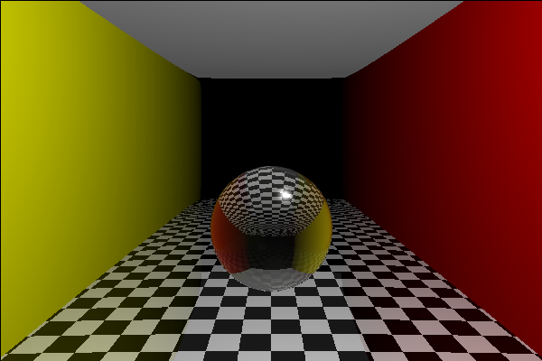

# ray-tracing

Ray Tracing is 3D rending algorithm which renders 3D objects on 2D screen. It is based on physics of light ray. It projects a ray from **camera** towards every **objects** on the **scene** and **shades** the hit objects by calling the same process **recursively** on **Reflected, Refracted, Shadow, Direct, etc** rays.

## Algorithm:
    
    for x, y in screen:
        ray = Ray(origin=camera, direction=unitVector(from=camer, to=(x, y))
        color(pixel(x, y)) = rayTrace(scene, lights, ray)
        
    rayTrace(scene, lights, ray):      
         Cast ray on all objects in the scene:
            if hit:
              color = ambient light term 
              For every light:
                  shadowRay = Ray(source=hitPoint, direction=towards light)
                  if not shadow:
                      # Phong and Blinn-Phong shading
                      color += diffuse color + specular color 
                  
                  if object is reflective:
                      color += refl_coef * rayTrace(scene, lights, reflected ray) 
                  if object is refractive:(transparent)
                      color += refr_coef * rayTrace(scene, lights, refracted ray)
                      
 ***
 
 This repo. contains implementation of **Ray-Tracing** algorithm entirely from **Scratch** in pure **Python and numpy**.
 (open-cv(cv2)  - only to show and save generated scene)

## Features of the code:
*  **Shadow**
*  **Reflection** -> Mirrors materials
*  **Refraction** -> Transparent materials
*  **Sphere, Rectangle, Triangle, Pyramid** shapes
*  **Floor material**

## Here's How To Run The Code:
### Dependencies:
*  numpy
*  open-cv(cv2)  - only to show and save generated scene
***
### To Run The Code
*  Diclare the **scene, lights, camera** in last *if __ name __ == '__ main __ :* section of **ray_tacing.py**
      
        python ray_tracing.py
        
## Sample Generated Scenes:
| | |
|:--------------------------------------------:|:------------------------------------------:|
|||
|||
